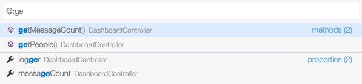
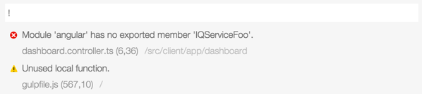
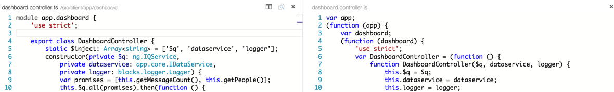
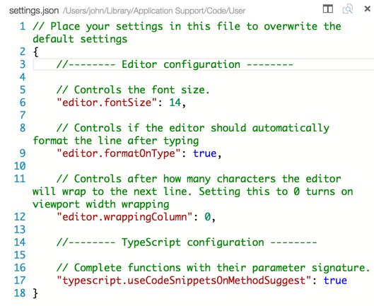

Visual Studio Code (vsCode) is a lightweight, super fast, cross platform development tool for building Web applications. It works well with both Node and ASP.NET v5. 


From their download page they describe Visual Studio Code succunctly as:

> Code focused development, evolved

I like and agree with that statement. They go on to say the following:

> Visual Studio Code is a free, modern cross-platform tool for building today's cloud and web applications

That's it in a nutshell. It's fast editing experience is similar to what you get with brackets, Sublime and Atom while it's debugging and integration experience is similar to what you get with WebStorm or Visual Studio. I consider it more along the lines of an [editor than an IDE](http://johnpapa.net/web-dev-with-editors-and-ides), personally. But it really does fit somewhere in between, grabbing the best of both worlds.

I like vsCode because its super fast and provides some rich develpoment features (code completion, navigation, deployment, debugging, git, task running).

More from the docs:

> It is a new class of tool, one which combines the speed of today's editors with rich code authoring and debugging, without the complexity that a full IDE can sometimes present to developers. While it focuses on the core edit-compile-debug cycle, it goes beyond those basic editor scenarios by providing helpful code completion, navigation, code understanding, refactoring, diagnostics, and deployment. 

vsCode is folder and file based. You can open a folder and work on its files. No project file. No solution file. Just grab the code folder and go.

## Start with an App
When playing with vsCode, it may be helpful to start with a project. Grab your own or use Hot Towel to generate. You can [install Hot Towel and generate a project quickly using these instructions](https://github.com/johnpapa/generator-hottowel#prerequisites).

If you want to see the app from the [demo from //Build you can grab it here](http://jpapa.me/vscodedemofrombuild).

	// TODO: get link for demo

## Quick Access
I find myself looking for a file, a variable, a function, a git command, or a task quite often. Especially when I do not know exactly where it is. vsCode provides quick access to these through quick access palettes and commands. 

### Command Palette

`CMD+P` opens the command palette. You can type what you are looking for and perform that action easily. No need to remember menu items or where that button may be hiding. Want to change your theme? Configure debugging? Open keyboard mapping preferences? Run tasks? Open a new console/terminal? This is the place. It's also a great place to just scroll through the entire list of avaialble commands.

`CMD+P` is the most helpful keystroke you'll use in Visual Studio Code.  It also shows the keyboard mapping for each command.


> Notice that you can delete the `>` and you are at the Navigate to File or Symbol palette. This is a nice feature so you can move between the various palettes easily.

### Navigate to File or Symbol

`CMD+O` opens the generic command palette where you can type `?` to see the various ways you can find and navigate to what you want. Type `CMD+O` and then `?` to see a list.

You can also access this by `CMD+P` then delete the `>`.


### Go to Symbol

`CMD+SHIFT+O` opens the Go to Symbol palette. The `@` prefix tells vsCode that you are searching for a symbol. You can then search for a local variable or function.


You can also access this by `CMD+P` then delete the `>` and type `@`. Or `CMD+O` then type `@`.

### Go to Symbol by Category

`CMD+SHIFT+O` opens the Go to Symbol palette, and typing an additional `:` allows you to search by category. 

This is context sensitive so in code it may categorize by property or function.



While in json it may search by array, object or string.


### Open Symbol by Name

`CMD+O` and type `#` so find a symbol by its name. 

This is context sensitive so in code it may categorize by property or function. For example, you can search for a symbol across your entire project. It searches the beginning of each symbol and it is clever enough to search by the changes in camel case (as shown below).


### Show Errors or Warnings

`CMD+O` then type `!` shows all of the current warnings or errors.



### Help for Commands

`CMD+O` then type `?` shows all of the types of global and editor commands you can run.


> We'll take a look at the git and task commands later in this post.

## Editor

### New Instances
I often want multiple instances of a tool open to work with different projects. vsCode makes this easy. Simply type `CMD+SHIFT+N` and a new instance of vsCode is opened.Here is show 2 instances (shrunken down a bit) with 2 different projects.


### New File
The simple `CMD+N` opens a new file. From here you can save, name it,  and keep on rolling.

### Autosave
Tired of losing changes? Or are you like me wher eyou hit `CMD+S` all day long? vsCode let's you enable automatic saving of files through a menu option. Me? I turned this on and never looked back.

 

### Split the Editor

`CMD+\` will split the editor. This is great for opening sna viewing multiple files side by side. Especially helpful for markdown and markdown preview. Even more helpful when transpiling LESS to CSS or TypeScript to JavaScript.

 


### Toggle Sidebar

`CMD+B` will toggle the sidebar to be shown or hidden. This is great when you need more real estate on your screen.

### Intellisense 
- Visual Studio Code provides excellent intellisense for JavaScript, TypeScript, and C#. Whether you are running ASP.NET vNext or node or client side code, you'll see a new level of intellisense here.
- You can also hit `CTRL+SPACE` and get intellisense. 

#### JSON Intellisense

Intellisense works in well known JSON files too, including `package.json` and `bower.json`. It uses schema information and looks up values to find likely matches, where possible.

Here you can see it finding all npm packages that match `gulp`.


Here you can see it finding the most appropriate versions and showing a message about what the versions mean.


### goto definition ( `F12` )

### peek definition ( `OPTION F12` )

### rename symbol across files 

### Find all references ( `SHIFT F12` )

### Rename symbols in all files ( `F2` )

### Change all occurrence in same file ( `CMD F2` )

### hover !

### dots next to files, when dirty

### save ... or enable auto save

## Compiling to TS


## Debugging

### Here is what WORKS for me for debugging:

- In Ticino, I the debug window, run the "Launch app.ts” and set a breakpoint in app.ts. This is fine if you have no gulp or grunt automation. Basic node.

- In Ticino, run the task `serve-dev` (which maps to `gulp serve-dev`), set a breakpoint in `app.ts`, and attach to it from Ticino.

- In Terminal run `gulp serve-dev` (which adds the `--debug` flag to node), set a breakpoint in `app.ts`, and attach to it from Ticino.

## Git

- git integration with green and red bar

## Preferences
You can adjust the setting sin vsCode by visiting the preferences and then overriding the default values with your own settings. You can access vsCode's preferences by either using the menu or via `CMD+,`.
 


When you open preferences you actuallu open 2 files. The default settings (which are read only) and the `settings.json` file, where you can adjust your own preferences.

Simply add your settings to the object in the `settings.json` and vsCode will use those instead of the defaults. These are stored in the `.settings` folder. I like push this file in github with my source control. 



## Styling
Light or dark theme? Zooming in? vsCode can do that too. I expect more to come when the rumored extensions are opened.

You can zoom in on the entire code window using `CMD++` or `CMD+-`, same as a browser.

You can swap between the light and dark themes from the menu `View` then `Theme` then `Light Theme` or `Dark Theme`.


 


## Keyboard Mapping
You can override the keyboard mappings for vsCode, too. These are exposed in a `keyboard.json` file and can be accessed via the `Code` menu and then selecting `Preferences` and `Keyboard Shortcuts`.


You will see 2 files again: 1 for the default keybindings and 1 for the overrides (`keybindings.json`). Unmapped actions appear as comments at the bottom of the default list of key bindings.


While in the keybindings you will enjoy intellisense and auto completion. 

Be sure not to set 2 key combinations to the same action.

## Running 
ticino from command line ... create file /usr/local/bin/ticino

```
#!/bin/bash
/Applications/Ticino.app/Contents/MacOS/Atom $@ 2>/dev/null &
```


