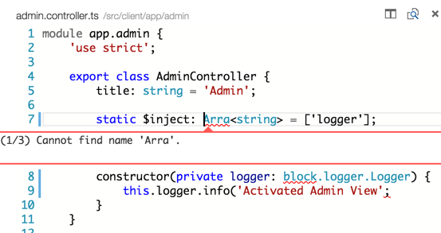
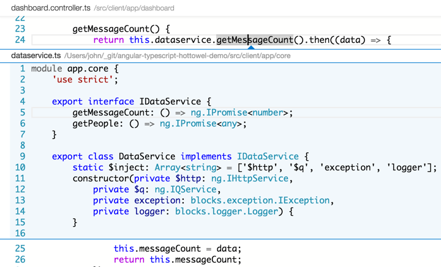
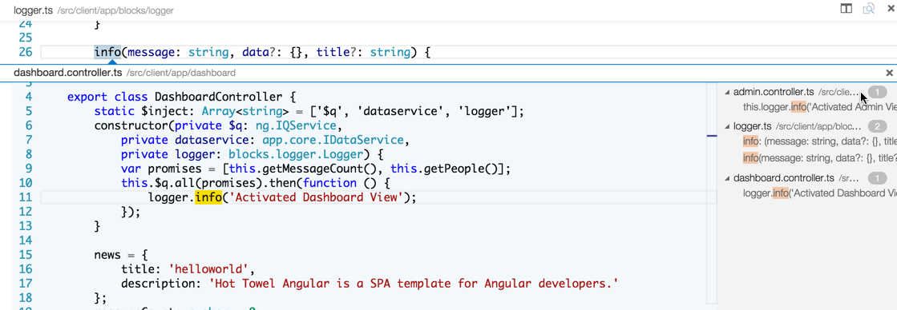
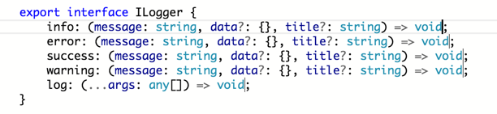

Visual Studio Code has some awesome refatoring features. Here are some of my favorites.

## Move Line Up / Down ( `OPT+UPARROW/DOWNARROW` )

VSCode will move a line up when you use `OPT+UPARROW` or down when you use `OPT+DOWNARROW`.

## Go to Next Marker ( `F8` )

When you have multiple errors or warnings, you can visit each of them in the current file using the Go to Next Marker feature. Press `F8` and you will see the first error or warning. Press `F8` again and you will see the next one.
	

## Go to Definition ( `F12` )

When you are looking at your code and you want to find where a function or variable is defined, you can press `F12` to navigate to the definition. This works in the same file or to another file when using TypeScript.

## Peek at Definition ( `OPTION F12` )

This is like the [Go to Definition](go-to-definition) except instead of navigating to the definition a window appears showing you a peek of the definition. Seeing is believing, so check this out below.

You can edit either file in this mode. If you want to navigate to the file, click on the file name in the header of the peek view. You can exit this mode and close the peek by clicking `ESC`.

## Find All References ( `SHIFT F12` )

VSCode help you find all references of a variable, everywhere it can be determined that it is being used. This works incredibly well with TypeScript. VSCode uses TypeScript to figure out how to find those references. As such, this feature works less great in JavaScript. 

This is helpful when refactoring so you can find all of the places a function or property may be used before refactoring.

Notice that the files are displayed ot the right. You can click on these to see each references. 

## Change All Occurrences
Put your cursor in a variable or function and click `CMD+F2` then begin typing. This will find all occurences in the open file and change them as you type, which is ideal for local refactoring. 

## Multi-Cursor

Click + `OPTION` in your code. Then find another place in code and repeat, and repeat, and repeat. Now you have multiple cursors in the file and you can edit all of them at once!

I love this, but I really want to also be able to do this through search via keyboard so I can find all instances of a phrase and then edit. 

## Rename symbols in all files ( `F2` )
Sometimes you want to rename in 1 file, and other times you want to rename across multiple files. For example, you may want to rename a publicly accessible function on an Angular service and have everywhere that uses it get updated.

First put your cursor on the member and click `F2`. 

Then type the new name and hit the `Enter` key. This will rename all of the occurences in every file in your project.

This shows the newly renamed `getThePeople` method in the `dataservice.ts` file.

This shows the newly renamed `getThePeople` method in the `dashboard.controller.ts` file.

## Format Code
VSCode makes it easy to format your code with the appropriate indentation and alignment through it's Format Code command. Just select the code block you want to format, use `CMD+P` to open the command palette, and type `format code`. You can also type part of the command as it will do partial matching. 