//TODO: Commentary on what I look for in a tool (refer to editor/IDE post)

// TODO: what i like and dont like about direction of VSCode

// TODO: credits to Chris, Erich, ASP.NET team (for their cross plat efforts), etc

## Visual Studio Code

Visual Studio Code (VSCode) is a lightweight, super fast, cross platform development tool for building Web applications. It works well with both Node and ASP.NET v5. 


From their download page they describe Visual Studio Code succinctly as:

> Code focused development, evolved

I like and agree with that statement. They go on to say the following:

> Visual Studio Code is a free, modern cross-platform tool for building today's cloud and web applications

That's it in a nutshell. It's fast editing experience is similar to what you get with brackets, Sublime and Atom while it's debugging and integration experience is similar to what you get with WebStorm or Visual Studio. I consider it more along the lines of an [editor than an IDE](http://johnpapa.net/web-dev-with-editors-and-ides), personally. But it really does fit somewhere in between, grabbing the best of both worlds.

I like VSCode because its super fast and provides some rich develpoment features (code completion, navigation, deployment, debugging, git, task running).

More from the docs:

> It is a new class of tool, one which combines the speed of today's editors with rich code authoring and debugging, without the complexity that a full IDE can sometimes present to developers. While it focuses on the core edit-compile-debug cycle, it goes beyond those basic editor scenarios by providing helpful code completion, navigation, code understanding, refactoring, diagnostics, and deployment. 

VSCode is folder and file based. You can open a folder and work on its files. No project file. No solution file. Just grab the code folder and go. When there is a project context, such as with ASP.NET 5, and you open a folder (with an ASP.NET 5 project), VSCode detects the project context. 

## Installing
[Read the docs here](https://ticino.azurewebsites.net/Docs#_setup) for more details on the prerequisites and how to install VSCode.


## Start with an App
When playing with VSCode, it may be helpful to start with a project. Grab your own or use Hot Towel to generate. You can [install Hot Towel and generate a project quickly using these instructions](https://github.com/johnpapa/generator-hottowel#prerequisites).

If you want to see the app from the demo from //Build you can grab it **here soon**. 

// TODO: Quick summary of hot towel: Node.js on the server JS and angular on the client.

## Quick Access
I find myself looking for a file, a variable, a function, a git command, or a task quite often. Especially when I do not know exactly where it is. VSCode provides quick access to these through quick access palettes and commands. 

### Command Palette

`CMD+P` opens the command palette. You can type what you are looking for and perform that action easily. No need to remember menu items or where that button may be hiding. Want to change your theme? Configure debugging? Open keyboard mapping preferences? Run tasks? Open a new console/terminal? This is the place. It's also a great place to just scroll through the entire list of avaialble commands.

> The name "Palette" and the idea is inspired by Sublime Text, which made this an immensely popular and useful feature.

`CMD+P` is the most helpful keystroke you'll use in Visual Studio Code.  It also shows the keyboard mapping for each command.


> Notice that you can delete the `>` and you are at the Navigate to File or Symbol palette. This is a nice feature so you can move between the various palettes easily.

### Navigate to File or Symbol

`CMD+O` opens the generic command palette wher eyou can search for any file or symbol in one place. You can also see recently opened files.

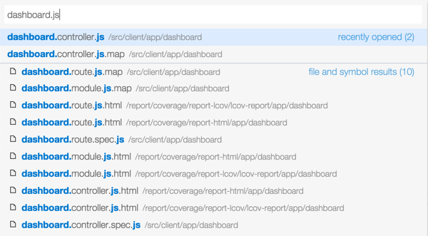

### Palettes ? 

Are you sensing a theme here? There are a few palettes to remember. But the good news here is that if you forget which command does what, you can always type `?` to see the various ways you can find and navigate to what you want. Type `CMD+O` and then `?` to see a list.

You can also access this by `CMD+P` then delete the `>`.

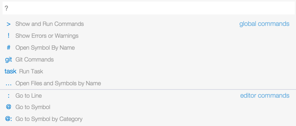

### Go to Symbol

`CMD+SHIFT+O` opens the Go to Symbol palette. The `@` prefix tells VSCode that you are searching for a symbol. You can then search for a local variable or function.


You can also access this by `CMD+P` then delete the `>` and type `@`. Or `CMD+O` then type `@`.

VSCode is context aware when showing the symbols. This means it makes it easy to search for contextually appropriate symbols in various types of files. When in TypeScript, JavaScript or C# you can navigate to symbols. When in CSS, LESS or SASS you can navigate to rules. When in JSON files, you can navigate to arrays or objects. When in special files such as `keybindings.json`, you can navigate to the assigned key bindings (due to the awareness of a JSON schema).

### Go to Symbol by Category

`CMD+SHIFT+O` opens the Go to Symbol palette, and typing an additional `:` allows you to search by category. 

This is context sensitive so in code it may categorize by property or function.


While in json it may search by array, object or string.


### Open Symbol by Name

`CMD+O` and type `#` so find a symbol by its name. 

This is context sensitive so in code it may categorize by property or function. For example, you can search for a symbol across your entire project. It searches the beginning of each symbol and it is clever enough to search by the changes in camel case (as shown below).


### Show Errors or Warnings

`CMD+O` then type `!` shows all of the current warnings or errors in the Error palette. You can also open the Error palette by clicking on the error and warnings counter in the status bar. 


### Help for Commands

`CMD+O` then type `?` shows all of the types of global and editor commands you can run.


> We'll take a look at the git and task commands later in this post.

## Editor

### New Instances
I often want multiple instances of a tool open to work with different projects. VSCode makes this easy. Simply type `CMD+SHIFT+N` and a new instance of VSCode is opened.Here is show 2 instances (shrunken down a bit) with 2 different projects.


### New File
The simple `CMD+N` opens a new file. From here you can save, name it,  and keep on rolling.

### Autosave
Tired of losing changes? Or are you like me wher eyou hit `CMD+S` all day long? VSCode let's you enable automatic saving of files through a menu option. Me? I turned this on and never looked back.

 

If you enable auto save and you have watchers on your files, those watchers will execute every time you change a file. 

If you disable auto save and you make changes to a file, you will see dots next to the files in the Working Files list.

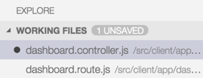 

### Split the Editor

`CMD+\` will split the editor. This is great for opening sna viewing multiple files side by side. Especially helpful for markdown and markdown preview. Even more helpful when transpiling LESS to CSS or TypeScript to JavaScript.

 

You can also open the sidebar from `CMD+O` using the two rectangle icon. Or you can hold the `CMD` and click with the mouse on the file in the File Explorer to open it in a new side panel.

VSCode allows you to have up to 3 code panels open in the editor.

### Toggle Sidebar

`CMD+B` will toggle the sidebar to be shown or hidden. This is great when you need more real estate on your screen.

### Intellisense 
- Visual Studio Code provides excellent intellisense for JavaScript, TypeScript, and C#. Whether you are running ASP.NET 5 or node or client side code, you'll see a new level of intellisense here.
- You can also hit `CTRL+SPACE` and get intellisense. 

If you hover over a variable VSCode shows the signature of a function or the type of a variable, if it can be determined.

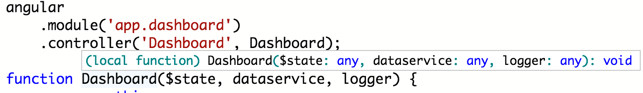

### JavaScript Intellisense
Out of the box we get basic intellisense for what the editor can determine on its own about the JavaScript code. VSCode will tell you a function's signature or what variables are available in scope.

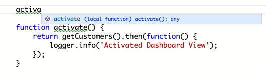 

When working in node.js VSCode provides intellisense across all of your JavaScript modules (the ones you write).

#### Quick Fix
Now let's assume you want intellisense for the JavaScript libraries or mode modules you use on the client or server. Perhaps you are using Angular and you want intellisense on it. Notice the green squiggly line under `angular`? Put your cursor on it then click the light bulb ( or `CMD+.` ) and choose `Add /// reference to angularjs/angular.d.ts`.

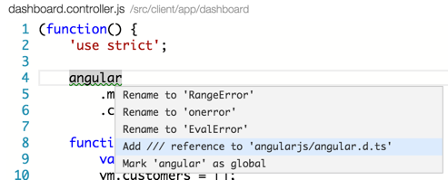 

VSCode will go and get the typings definition file for Angular and add it to your project, reference it in the file and you instantly have intellisense for Angular! (VSCode grabs the typings files from the Definately Typed repository.)

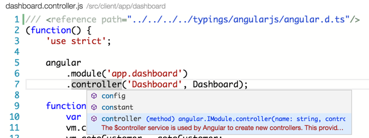 

We can now repeat this by adding jQuery code to a file. Put the cursor on the `$`, click `CMD+.`, and pull down the typings file. Now we have jQuery intellisense, too. 

#### Consolidating into a tsd.d.ts

Do you see the 2 `///` references and how the can accumulate? You can make a single `tsd.d.ts` with the npm package named `tsd`.

```bash 
npm install tsd -g
# cd to your project folder
tsd query -r -o -a install angular jquery
```

This produces a `tsd.d.ts` file which you can reference in your JavaScript files to get intellisense. Now you have 1 place to put all of you typings for JavaScript projects. 

>I think the story for this will get even better too, since VSCode uses TypeScript under the covers for its tooling. 

#### Additional Hints
If you try to create a type in a JavaScript file, VSCode will warn you that it is not valid.

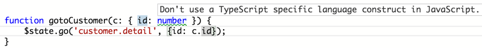 

### TypeScript Intellisense
The intellisense and editor experience is top notch when using TypeScript. VSCode provides intellisense across multiple files because TypeScript understands the `import` statement. 

VSCode provides intellisense for third party libraries, if you include the typings `*.d.ts` files. This works the same as it does with JavaScript files. You can use the [Quick Fix](#Quick-Fix) feature to add a typing automatically.

### JSON Intellisense

Intellisense works in well known JSON files too, including `package.json` and `bower.json`. It uses schema information and looks up values to find likely matches, where possible.

Here you can see it finding all npm packages that match `gulp`.

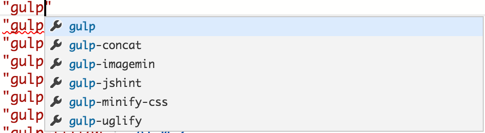

Here you can see it finding the most appropriate versions and showing a message about what the versions mean.

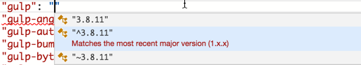

### Go to Next Marker ( `F8` )

	//TODO - great for warnings/errors
	
### Move Line Up / Down ( `OPT+UPARROW/DOWNARROW` )

	//TODO

### goto definition ( `F12` )

	//TODO

### peek definition ( `OPTION F12` )

	//TODO

### rename symbol across files 

	//TODO

### Find all references ( `SHIFT F12` )

	//TODO

### Change All Occurrences
Put your cursor in a variable or function and click `CMD+F2` then begin typing. This will find all occurences in the open file and change them as you type, which is ideal for local refactoring. 


### Rename symbols in all files ( `F2` )
Sometimes you want to rename in 1 file, and other times you want to rename across multiple files. For example, you may want to rename a publicly accessible function on an Angular service and have everywhere that uses it get updated.

First put your cursor on the member and click `F2`. 

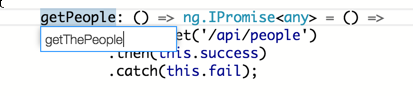

Then type the new name and hit the `Enter` key. This will rename all of the occurences in every file in your project.

This shows the newly renamed `getThePeople` method in the `dataservice.ts` file.
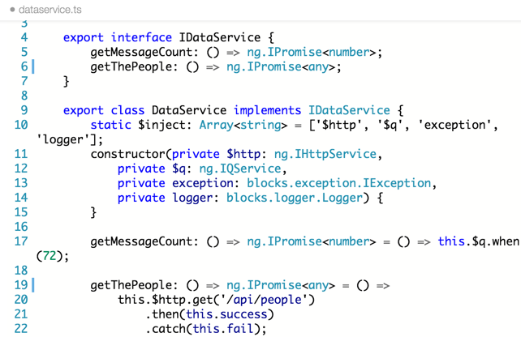

This shows the newly renamed `getThePeople` method in the `dashboard.controller.ts` file.
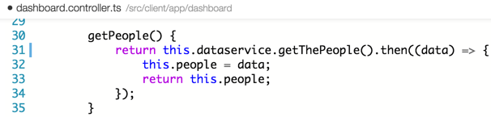

## Format Code
VSCode makes it easy to format your code with the appropriate indentation and alignment through it's Format Code command. Just select the code block you want to format, use `CMD+P` to open the command palette, and type `format code`. You can also type part of the command as it will do partial matching. 

## Compiling to TS

	//TODO

## Debugging
There are various ways you can debug server side code with VSCode. You may have a simple node server to crank up. Perhaps you use TypeScript and need to compile it to JavaScript before starting the server. You may also be using task automation with gulp or grunt and want to start the server and then attach VSCode's debugger to it.

### Debugging JavaScript
You can debug server side JavaScript in right ni VSCode. Just create a debug launch task and go. First, click on the debug icon in the sidebar or `CMD+SHIFT+D`. Then click on the gear icon next to the debug button in the upper left. This opens the debug configuration settings (in `.settings/launch.json`).

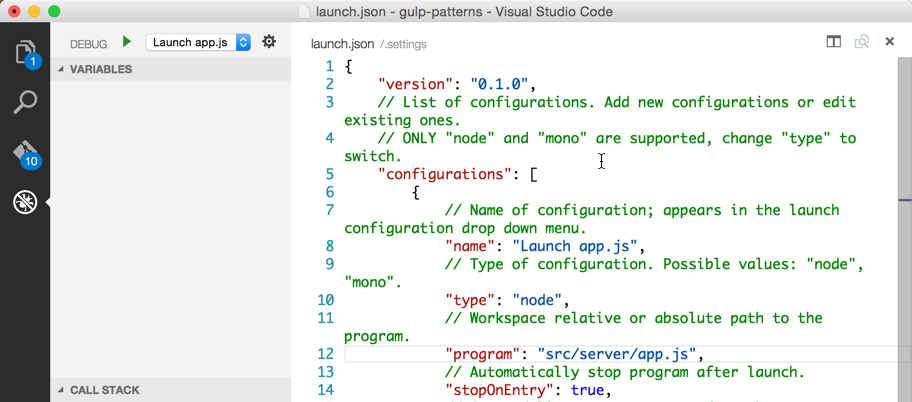

Here you can define a launch configuration for debugging. Notice the type is set to node and the `program to start` is set to `/src/server/app.js` (choose your path accordingly). It will also stop upon entry, so you can debug on the first entrypoint to the `app.js`. This is important when you want to see how the node server is being started.

Once the debug configuration is established you can choose your configuration form the dropdown and click the green button, or alternatively press `F5` to begin debugging.

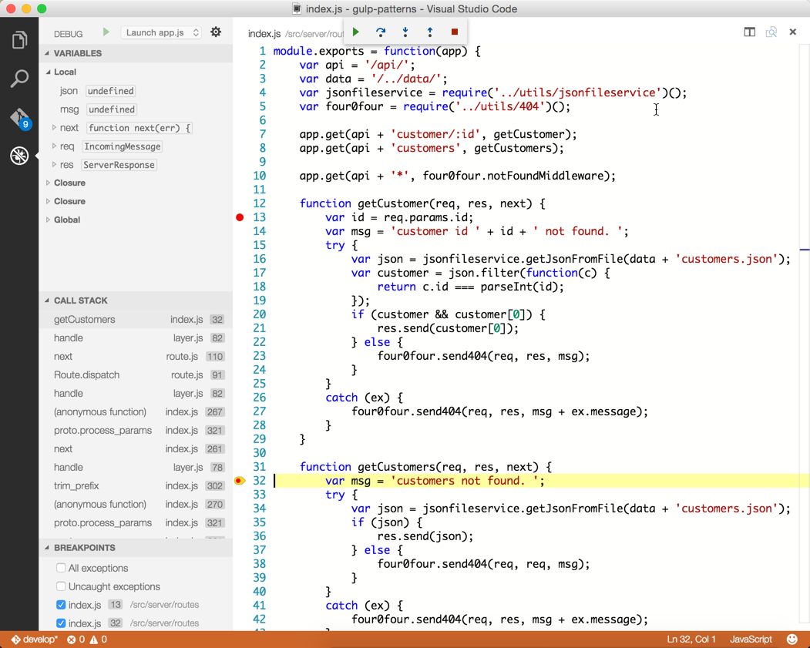

The node server will start and stop at the first line of code in `app.js`. You can then set watchers, breakpoints (or disable them), see the call stack, or examine local variables.

### Debugging Menu Options

You can also step through the code using the debug menu in the top middle of VSCode. 


The buttons have keyboard mappings for:

- `F5` continue
- `F10` step over
- `F11` step into
- `SHIFT+F11` step out
- `SHIFT+F5` stop

> I often will set breakpoints in my routes and then go use the app in the browser. When the route is hit, the browser will wait and VSCode will show the breakpoint. This workflow is ideal for debugging calls between the browser and the server.

### Debugging TypeScript

Debugging TypeScript is just as easy as JavaScript. 

- Go to the debug configurations ( `CMD+SHIFT+L` )  
- Set the `program to start` to `/src/server/app.ts` (or whatever your path is)
- Run the `Launch app.ts` configuration 
- Set a breakpoint in `app.ts`

Enjoy debugging!

### Running Gulp Tasks
OK, that's great that you can debug if you have a simple node server, but what if you use Gulp or Grunt for task automation? Let's use the sample from the demo.

You can run any gulp task directly from the palette by clicking `CMD+O` followed by `task` and a space. 

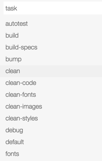

If you choose a task that starts the node server and sets the `--debug` flag, then you can attach the VSCode debugger to it. The sample app has a gulp task called `serve-dev` that starts the server and sets the `--debug` flag, so let's run that.

Then go to the debug window by clicking the debug icon or `CMD+SHIFT+D`. Choose `Attach` from the dropdown and click the green arrow to start debugging.

### Creating Tasks
While you can run a gulp task from the command palette, sometimes it is beneficial to set up a a task configuration in VSCode to customize how you want to run the task. This is an abstraction that VSCode offers because there are a variety of task runners and this provides a consistent way to run them all. It also provides custom matchers which can be used to gather the ouput form the tasks and use them to fill in the errors or warnings in VSCode. (For example there may be some errors from a linting task.)

To set up a task configuration click `CMD+P` to open the command palette and type `task`. Then select `task configuration`.

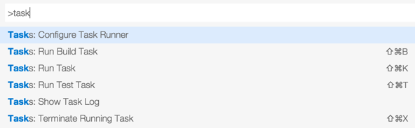

This opens the `.settings/tasks.json` file which is where you can define tasks to execute. The `command` should be set to whatever command you want to execute. In this case it is `gulp`. Then the `tasks` array is configured for every task you want to run. The image below shows several tasks including `gulp serve-dev`, `gulp tsc-compile`, and `gulp test`. 

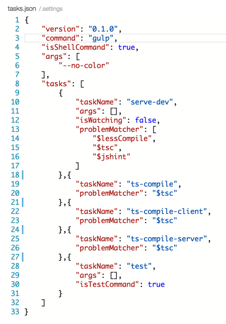

One task may be assigned as the build command, which in this case is `gulp serve-dev`. One task may be assigned as the test command, which in this case is `gulp test`. This means when you click `CMD+SHIFT+B` to build it will run the `gulp serve-dev` task. Likewise, when you click `CMD+SHIFT+T` to run the tests, the `gulp test` command will execute.

To try this out, run the task `serve-dev`, set a breakpoint in `app.ts`, then go to the debug window by clicking the debug icon or `CMD+SHIFT+D`, choose `Attach` from the dropdown and click the green arrow to start debugging.

> You can also go to Terminal and run a gulp command. The sample code has a task `gulp serve-dev` which adds the `--debug` flag to node. Then you can set a breakpoint in `app.ts` and attach to it from VSCode.

## Git

- git integration with green and red bar

	//TODO

## Snippets

// TODO - coming soon

## Preferences
You can adjust the setting sin VSCode by visiting the preferences and then overriding the default values with your own settings. You can access VSCode's preferences by either using the menu or via `CMD+,`.
 
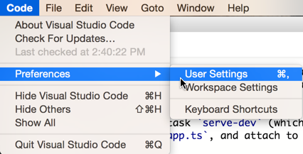

When you open preferences you actuallu open 2 files. The default settings (which are read only) and the `settings.json` file, where you can adjust your own preferences.

Simply add your settings to the object in the `settings.json` and VSCode will use those instead of the defaults. These are stored in the `.settings` folder. I like push this file in github with my source control. 


## Styling
Light or dark theme? Zooming in? VSCode can do that too. I expect more to come when the rumored extensions are opened.

You can zoom in on the entire code window using `CMD++` or `CMD+-`, same as a browser.

You can swap between the light and dark themes from the menu `View` then `Theme` then `Light Theme` or `Dark Theme`.


 


## Keyboard Mapping
You can override the keyboard mappings for VSCode, too. These are exposed in a `keyboard.json` file and can be accessed via the `Code` menu and then selecting `Preferences` and `Keyboard Shortcuts`.


You will see 2 files again: 1 for the default keybindings and 1 for the overrides (`keybindings.json`). Unmapped actions appear as comments at the bottom of the default list of key bindings.


While in the keybindings you will enjoy intellisense and auto completion. 

Be sure not to set 2 key combinations to the same action.
