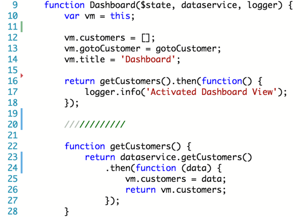
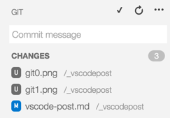
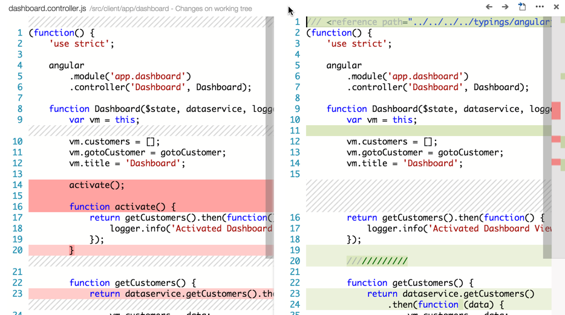

Visual Studio Code has a good symbiosis with allowing you to customize the editor through styling, preferences, keyboard mappings, tasks, and more. Here are some examples of how to get started.

## Git Integration
VSCode integrates well with git. When you make changes to your files you see red and green indicators in the left hand gutter of the editor. These markers show the changes you just made at those locations. Red indicates removed lines, green indicates added lines, and blue indicates changed lines.

You can then click the git icon in the sidebar and see all of the changes. From here you can clean them (revert) one by one or as a group. You can also commit them all, add a commit message, and even push them right to the remote git repository.

If you click on the file in the git view, VSCode will show you a side by side of the current state of the file as ompared to its previos state.

## Preferences
You can adjust the setting sin VSCode by visiting the preferences and then overriding the default values with your own settings. You can access VSCode's preferences by either using the menu or via `CMD+,`.
 

When you open preferences you open 2 files. The default settings (which are read only) and the `settings.json` file, where you can adjust your own preferences.

Simply add your settings to the object in the `settings.json` and VSCode will use those instead of the defaults. These are stored in the `.settings` folder. I like push this file in github with my source control. 

## Styling
Light or dark theme? Zooming in? VSCode can do that too. I expect more to come when the rumored extensions are opened.

You can zoom in on the entire code window using `CMD++` or `CMD+-`, same as a browser.

You can swap between the light and dark themes from the menu `View` then `Theme` then `Light Theme` or `Dark Theme`.

 

## Keyboard Mapping
You can override the keyboard mappings for VSCode, too. These are exposed in a `keyboard.json` file and can be accessed via the `Code` menu and then selecting `Preferences` and `Keyboard Shortcuts`.

You will see 2 files again: 1 for the default keybindings and 1 for the overrides (`keybindings.json`). Unmapped actions appear as comments at the bottom of the default list of key bindings.

While in the keybindings you will enjoy intellisense and auto completion. 

Be sure not to set 2 key combinations to the same action.
